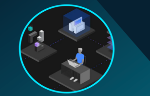
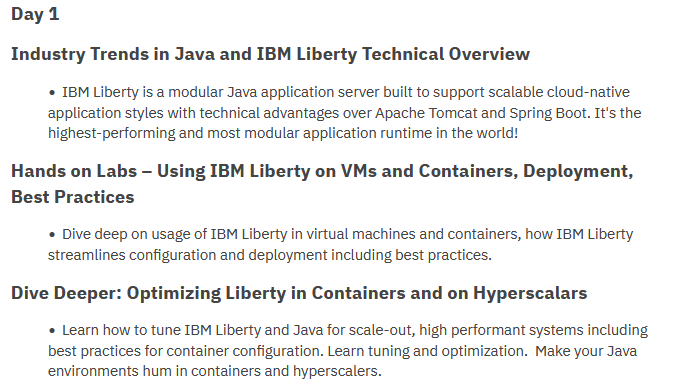
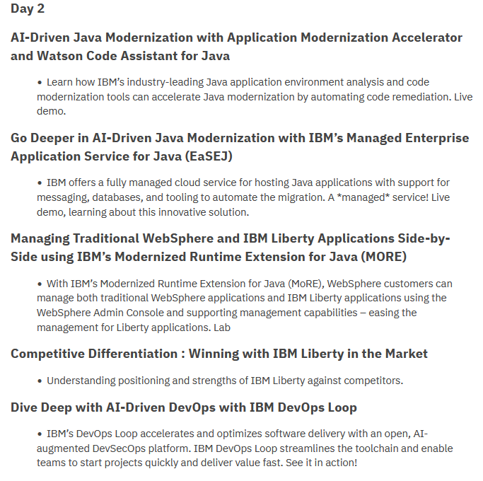

# Business Partner AI-infused Java and DevOps TechJam, an IBM TechXchange Workshop

**September 9 - September 10** 

9:00 AM USA CT to 5:00 PM USA CT

Dallas, Texas

------------------------------------------

**Agenda** 

  - This is a 2 day technical workshop.  
  - Refer to the daily labs pages from the left-navigation section.
  
  

**Agenda**

**Shared with attendees**

[TechJam content to share](https://ibm.box.com/s/e6vlc6y1ydhsnes531v1y6c1alwlag24)
 

**Hands on Activities**

From the _navigation menu_, select the **Hands-on Labs** menu option.  

There, you will find the links to the hands-on **lab guides** and information to accces the **Lab environments** 

